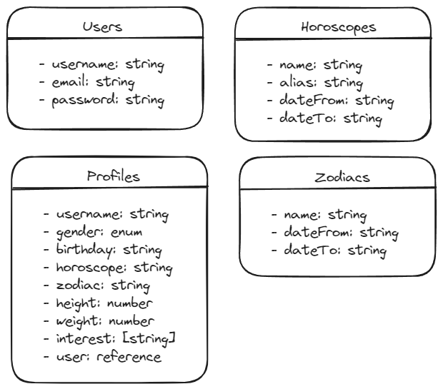
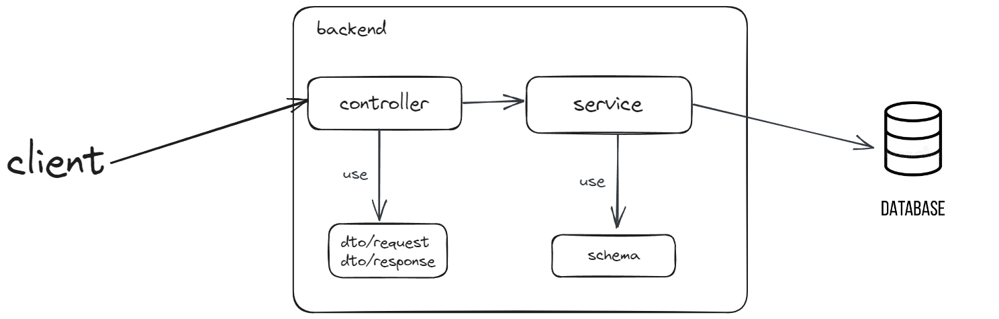

<div align="center" style="padding-bottom: 20px">
    <h1>backend-api</h1>
    
    
    
    
</div>

## Description:

**backend-api** with CRUD operations to make a request. In order to retrieve/get/create/update/delete **JWT** is required. (Authorization: **Bearer** {token} attached to the headers). API provides endpoints for registration and token retrieval (access token). With this access token, the user can access data related to the database through the API because the user is authenticated.

## Used Frameworks, libraries, tools, databases:

- NestJS + MongoDB + Mongoose + Jest

## Tools:

- WebStorm, Swagger

## Api Documentation:

<details>
<summary>Register User</summary>

#### Description

Register new user.

#### Request

- **Method:** `POST`
- **URL:** `/auth/register`
- **Body:**
```json
{
  "username": "string",
  "email": "string",
  "password": "string"
}
```
#### Response

- **Status Code:** `201 Created`
- **Response Format:** JSON

##### Successful Response

```json
{
  "token": "value1"
}
```
</details>

<details>
<summary>Login</summary>

#### Description

Login user.

#### Request

- **Method:** `POST`
- **URL:** `/auth/login`
- **Body:**
```json
{
  "email": "string",
  "password": "string"
}
```
#### Response

- **Status Code:** `200 OK`
- **Response Format:** JSON

##### Successful Response

```json
{
  "token": "string"
}
```
</details>


<details>
<summary>Get User Profle</summary>

#### Description

Get user profile.

#### Request

- **Method:** `GET`
- **URL:** `/auth/profile`
- **Headers:**
    - `Authorization: Bearer token`

#### Response

- **Status Code:** `200 OK`
- **Response Format:** JSON

##### Successful Response

```json
{
  "message": "string",
  "code": "string",
  "data": [
    {
      "name": "string",
      "gender": "string",
      "birthday": "string",
      "horoscope": "string",
      "zodiac": "string",
      "height": "string",
      "weight": "string",
      "interest": ["string"]
    }
  ]
}
```
</details>

<details>
<summary>Create User Profle</summary>

#### Description

Create user profile.

#### Request

- **Method:** `POST`
- **URL:** `/auth/profile`
- **Headers:**
    - `Authorization: Bearer token`
- **Body:**
```json
{
  "name": "string",
  "gender": "string",
  "birthday": "string",
  "height": "string",
  "weight": "string",
  "interest": ["string"]
}
```
#### Response

- **Status Code:** `201 Created`
- **Response Format:** JSON

##### Successful Response

```json
{
  "message": "string",
  "code": "string",
  "data": [
    {
      "name": "string",
      "gender": "string",
      "birthday": "string",
      "horoscope": "string",
      "zodiac": "string",
      "height": "string",
      "weight": "string",
      "interest": ["string"]
    }
  ]
}
```
</details>

<details>
<summary>Update User Profle</summary>

#### Description

Update user profile.

#### Request

- **Method:** `PUT`
- **URL:** `/auth/profile`
- **Headers:**
    - `Authorization: Bearer token`
- **Body:**
```json
{
  "name": "string",
  "gender": "string",
  "birthday": "string",
  "height": "string",
  "weight": "string",
  "interest": ["string"]
}
```
#### Response

- **Status Code:** `200 OK`
- **Response Format:** JSON

##### Successful Response

```json
{
  "message": "string",
  "code": "string",
  "data": [
    {
      "name": "string",
      "gender": "string",
      "birthday": "string",
      "horoscope": "string",
      "zodiac": "string",
      "height": "string",
      "weight": "string",
      "interest": ["string"]
    }
  ]
}
```
</details>

## Database schema:



## Software Architecture:



## Testing:

Unit test and end to end test using Jest.
Go to [e2e test.](test/app.e2e-spec.ts)

##### `auth` tests:

- Register a new user
- Login user
- Not accept invalid email
- Not register duplicate email
- Not login (not register yet)

##### `profile` tests:

- Create new profile
- Get data profile
- Update data profile
- Unauthorized in create profile
- Unauthorized in update profile
- Unauthorized in get profile
- Not accept invalid birthday

## Clone and Local Development

```shell
git clone git@github.com:rizki-nm/nestjs-mongodb.git
```

```bash
$ pnpm install
```

## Running the app

```bash
# development
$ pnpm run start

# watch mode
$ pnpm run start:dev

# production mode
$ pnpm run start:prod
```

## Test

```bash
# unit tests
$ pnpm run test

# e2e tests
$ pnpm run test:e2e

# test coverage
$ pnpm run test:cov
```
